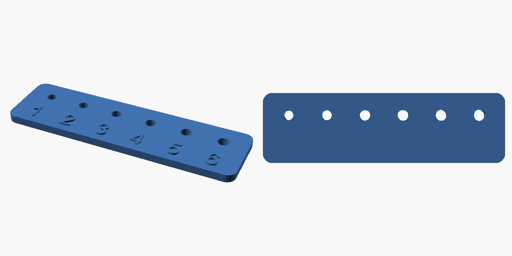
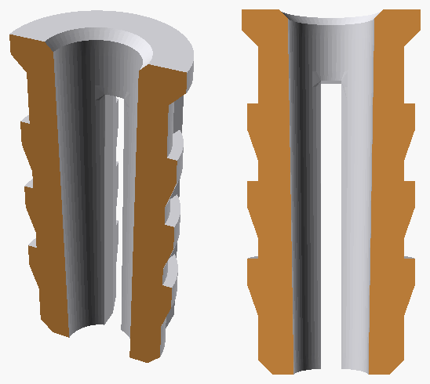
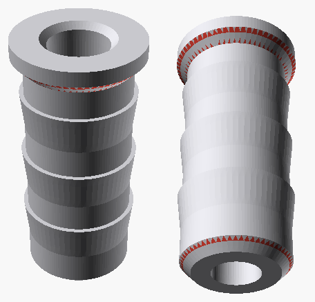
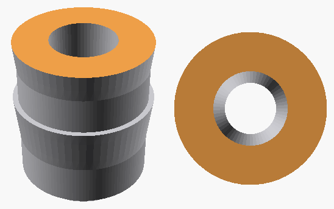

# forgeAi3d

**English** · [Русский](README.ru.md)

A workspace for designing 3D-printable parts **together with an AI agent**.

I did not write a CAD engine. forgeAi3d is an assembly of other people's
projects — a CAD kernel, a fastener library, a printability analyser, a renderer, mesh
tooling — wired into a single loop and wrapped in CLIs so the agent can call them itself,
read the output and take the next step from it: measure the part, look at the preview,
change one constant. What to call and when lives in the skill; the full list is in the
table below.

The idea is simple: a part is a Python file, not a project inside a GUI. The agent sees
it whole, edits one line, and keeps the history. You describe what you need and get an
STL, a preview and a printability report. You print it, say what is wrong, and one
constant changes.

```
what you need → models/part.py → prints/part/part.stl → print
                      ↑                                 │
                      └── "the hole is half a mm small" ┘
```



## What it is made of

Little of this is my own code: a printer profile and a filament reference (`forge/`),
four CLI wrappers (`tools/`) and the skill. The heavy lifting is done by the projects
below.

| Tool | What it does here |
|---|---|
| [build123d](https://github.com/gumyr/build123d) | The CAD kernel. A part is described in Python and the geometry is B-Rep on OpenCascade: real fillets, chamfers and STEP export |
| [OCP](https://github.com/CadQuery/OCP) | Python bindings for [OpenCascade](https://github.com/Open-Cascade-SAS/OCCT), the kernel under build123d. `measure.py` talks to it directly — it reads surface types and tells a hole from a boss or a fillet by them |
| [bd_warehouse](https://github.com/gumyr/bd_warehouse) | Off-the-shelf fasteners for build123d: screws, nuts, bearings and threads to standard, so M3 dimensions are never recalled from memory |
| [augura](https://github.com/pzfreo/augura) | Printability checks off the STEP — overhangs, bridges, wall thickness, tipping, orientation search. From the exact faces of the solid rather than from triangles |
| [trimesh](https://github.com/mikedh/trimesh) | Everything mesh-side: loading STL, watertightness, normals, ray queries (thickness, internal voids), repairing other people's models |
| [manifold3d](https://github.com/elalish/manifold) | The boolean backend for trimesh — without it mesh differences and unions fall apart |
| [rtree](https://github.com/Toblerity/rtree) | The spatial index trimesh's ray queries rely on |
| [numpy](https://github.com/numpy/numpy) | Vertex and normal arrays, all the geometric arithmetic in the checks and in the overhang highlighting |
| [networkx](https://github.com/networkx/networkx) | The face-adjacency graph in `solidify.py`: this is how inner shells and the rims to be capped are found |
| [Pillow](https://github.com/python-pillow/Pillow) | Trimming the margins of renders and stitching the views into one contact sheet |
| [OpenSCAD](https://github.com/openscad/openscad) | Headless PNG rendering and the boolean section cut. The only external program — everything else is a Python package |
| [uv](https://github.com/astral-sh/uv) | Dependencies and running: `uv run` instead of hand-managed venvs |
| [Claude Code](https://github.com/anthropics/claude-code) | The agent the skill in `skill/` is written for — what to call, how to read the output and what to edit next. The format is its own, but the contents are plain markdown: any other agent can be taught it with one request |

## Why not a GUI editor with MCP

A GUI editor behind MCP makes the agent click around someone else's interface: it cannot
hand you a file, and it cannot take your STL as anything but an array of coordinates.
Here it is the other way round — a file goes in, a file comes out, and in between there
is text the agent reads and edits.

A side benefit: the part's parameters become named constants. "Make the wall thicker" is
a one-line edit, not a redraw.

## Install

You need [uv](https://docs.astral.sh/uv/) and OpenSCAD.

```bash
git clone git@github.com:StasPotapov/forgeAi3d.git ~/dev/forgeAi3d
cd ~/dev/forgeAi3d
uv sync
```

On macOS install the **snapshot cask** — the stable `openscad` is a 2021.01 Intel build
that macOS complains about:

```bash
brew install --cask openscad@snapshot
```

On Linux use `apt install openscad` or your distribution's package. The tools look for
an `openscad` binary on `PATH`, and additionally in `/Applications` on macOS.

The repository can live anywhere: paths are resolved from the package itself and can be
overridden with `FORGEAI3D_HOME`.

## Quick start

```bash
uv run python models/fit_test.py                                  # -> prints/fit_test_pla/
uv run tools/measure.py prints/fit_test_pla/fit_test_pla.stl         # dimensions and holes as numbers
uv run tools/preview.py prints/fit_test_pla/fit_test_pla.stl         # contact sheet
uv run tools/check.py prints/fit_test_pla/fit_test_pla.stl --material PLA   # print it or not
```

The path to the STL is enough for every tool: they find the STEP for exact analysis
themselves.

`models/fit_test.py` is a clearance comb: ten M3 holes with per-side clearances from 0.00
to 0.45 mm. Printing it is optional — it is there for when the typical clearances do not
work out (see "Clearance calibration" below).

## Two real examples

### A wall plug, built from a description

The task arrived as a sentence: a furniture plug for a 5 mm hole and a 3.5×15 screw.
I supplied three numbers; the agent decided the rest and said so out loud — PETG, because
it is ductile and survives being wedged apart; a `press` fit, because a plug is hammered
in; ring barbs instead of the classic split legs, since at a wall of about a millimetre
printed legs snap along the layers; a 6 mm collar so it hides under the screw's 7 mm head.



Then came the loop this is all for. The first version spun in the hole: ring barbs hold
against pull-out, but an axisymmetric body has nothing to bite with against torque, so the
screw dragged the plug along instead of threading into it. One sentence — "it spins" — and
the model was reworked: a through slit along the body (the halves spread apart and wedge
the plug into the hole), four longitudinal ribs against rotation, and a pilot hole 0.3 mm
wider, so the screw cuts a thread rather than tearing the part loose.

The model is `models/dowel_5mm.py`, and everything in it turns on constants: `BARB_OVER`
for how far the barbs stand out, `RIB_COUNT` and `RIB_OVER` for the ribs, `PILOT_TOP` and
`PILOT_BOT` for the inner cone that makes the screw bite harder as it goes, `SLOT_W` and
`SLOT_ANG` for the slit. Printed standing up on an A1 mini.

### A toy katana blade — someone else's model, filled

The second case was not modelling but repairing an incoming STL. The twisted blade of a
toy katana turned out to be a hollow tube with a wall of about 1.2 mm: the slicer honestly sees
the cavity and prints it as a void, leaving the part brittle. It had to become solid
without touching the outer shape.

```
$ uv run tools/solidify.py katana.stl
katana.stl: 5161 mm³, internal voids found: 1
  [1]  1496 triangles, area   4013.6 mm², size 11.2×9.7×168.8 mm, open edges 42

$ uv run tools/solidify.py katana.stl --fill 1
internal triangles removed: 1496 of 3726
volume: was 5161 mm³ → now 11335 mm³
```

The outer triangles are taken from the original untouched, so the twisted profile and the
sharp edges are exactly as they were. The volume doubled — what happens inside is now the
slicer's business.

## Describing your printer

All hardware and all filaments live in one file — **`forge/spec.py`**. Out of the box it
holds a Bambu Lab A1 mini with PLA and PETG.

```python
A1_MINI = Printer(
    name="Bambu Lab A1 mini",
    bed=(180.0, 180.0, 180.0),
    nozzle=0.4,
    extrusion_width=0.42,   # perimeter line width
    layer_height=0.2,
    enclosed=False,         # no chamber -> ABS/ASA will not run
    hardened_nozzle=False,  # not hardened -> no abrasives
    ams=False,
    bed_slinger=True,       # bed moves in Y -> tall parts wobble
)

AVAILABLE = ("PLA", "PETG")   # what is actually on the shelf
```

Describe your printer and keep `AVAILABLE` honest — the checks will then reject
incompatible materials on their own.

## How models use it

Instead of magic numbers, calls into `forge`:

```python
from forge import clearance, wall, compensate_shrink, export_all

MAT = "PETG"
shaft_hole = 8 + 2 * clearance(MAT, "slip")   # 8.6 mm; PLA would give 8.4
case_wall  = wall(3)                          # 1.26 mm = 3 perimeters, not "about 1.5"
length     = compensate_shrink(150, MAT)      # 150.9 mm allowing for shrinkage

export_all(part.part, "part", material=MAT)   # stl + step + 3mf, writes verified
```

Fit types: `press`, `snug` (hand pressure), `slip` (moves freely), `free` (deliberately
loose). Clearance is **per side**; a hole gets twice that.

Besides PLA and PETG the reference carries `PLA-CF`, `ASA` and `TPU` — so that
`supported()` can name the reason a material will not run on this printer (ASA without
a chamber, PLA-CF without a hardened nozzle) instead of silently inventing a clearance.

Dimensions of other people's hardware, the ones you cannot measure yourself, are looked
up in a datasheet and cached together with the source — a number without a link is not
accepted:

```python
from forge import get_spec, save_spec
save_spec("raspberry pi 5", {"length": 85.0, "width": 56.0},
          source="https://datasheets.raspberrypi.com/rpi5/raspberry-pi-5-mechanical-drawing.pdf")
```

## What comes out

Every part gets its own folder. Only the STL — the file you take to the slicer — sits in
plain view; everything else moves into `extras/`, so the one file you need is never
buried among the working ones:

```
prints/stand/
    stand.stl                     ← this is what gets printed
    extras/stand.step             ← CAD edits and exact analysis
    extras/stand.3mf              ← Bambu Studio: millimetres, name, material
    extras/stand.png              ← preview
    extras/stand-overhangs.png    ← overhangs in red
    extras/stand-section-y.png    ← section
```

## tools/measure.py

Answers "is this what was asked for" with numbers rather than a picture.

```bash
uv run tools/measure.py prints/part/part.stl
uv run tools/measure.py prints/part/part.stl --json
```

Prints the bounding box, volume, solid count and an inventory of round features: holes
with diameter, depth and centre coordinates, posts, external rounds and internal fillets.
Identical ones collapse into `4 × Ø3.40`. A hole is called *through* based on geometry
rather than on the part's bounding box — a chamfer or embossed text shifts the box and
would fool that test.

## tools/preview.py

Renders an STL to PNG with headless OpenSCAD and tiles the views into one contact sheet,
so the agent can look at the result before handing over the file.

```bash
uv run tools/preview.py prints/part/part.stl                        # iso, top, front, right
uv run tools/preview.py prints/part/part.stl --overhangs --material PETG
uv run tools/preview.py prints/part/part.stl --section y            # or y:12.5
uv run tools/preview.py prints/part/part.stl -o /tmp/p.png --size 800
```

Without `-o` the image lands in that part's `extras/`, its name tagged with the mode.
`--size` is the render resolution: the frame is then cropped to the part, so a tile
comes out smaller than requested.

Views: `iso`, `iso2`, `iso3`, `iso4` (isometric from four sides), `top`, `front`,
`right`, `back`, `iso_low`, `bottom`.

`--overhangs` paints everything that needs support red, and switches to the lower views
by itself — overhangs are invisible from above:



`--section` cuts the part open. There is no other way to check a wall thickness without
printing the part. The cut plane is painted orange and the views are taken from the side
of the removed half — otherwise the frame just shows the intact part:



## tools/check.py

Checks a part before printing.

```bash
uv run tools/check.py prints/part/part.stl --material PETG
uv run tools/check.py prints/part/part.stl --nozzle 0.6 --bed 256x256x256
uv run tools/check.py prints/part/part.stl --no-orientation    # skip the orientation search
```

Geometry is analysed by [augura](https://github.com/pzfreo/augura), from the exact faces
of the solid rather than from triangles: overhangs, bridges, wall thickness, tip-over,
brim, bed fit, and the smallest vertical step (which is also your maximum layer height).
It also ranks poses and suggests the one with the least unsupported overhang.

For thickness augura reports the minimum, but a part is failed on the **share of the
surface** below two perimeters: at a chamfer, a draft or the edge of embossed text the
thickness tends to zero by construction, so judging by the minimum alone would fail every
part with a label on it. The minimum stays in the report for reference.

Given an STL, a STEP of the same name next to it is picked up and used instead. Without
a STEP the analysis is approximate: **wall thickness and small features are not computed
from a mesh**, and the report says so.

Mesh quality itself — watertightness, winding, degenerate triangles, body count — is
checked from the STL, since a STEP cannot have those problems by construction.

**Exit code 1** means do not print: a leaky mesh, a wall that is too thin, a part that
will topple, one that fits the bed in no orientation, or a material the printer cannot
run. A part that fits after a 90° turn in the bed plane is a warning rather than a
failure: augura measures the bounding box along the axes as given, while on the bed you
place the part whichever way is convenient.

**Warnings do not affect the exit code** — they depend on how the part is placed, and
that is decided in the slicer: overhangs, brim, the suggestion to rotate.

## tools/solidify.py

Fills the internal cavity of someone else's mesh. A hollow model (a tube, a vase-mode
print, a scanned shell) prints empty: the slicer honestly sees the void and puts no
infill inside.

```bash
uv run tools/solidify.py incoming.stl               # show what is inside
uv run tools/solidify.py incoming.stl --fill 1     # -> prints/incoming_solid/
```

First the tool lists the voids it found — triangle count, area, bounding box, and how
many open edges the void has (zero means a sealed cavity):

```
katana_orig.stl: 5161 mm³, internal voids found: 1
  [1]  1496 triangles, area   4013.6 mm², size 11.2×9.7×168.8 mm, open edges 42
```

**You choose what to fill.** Telling a cavity from a through hole automatically is not
possible: to a ray the wall of a hole looks just as internal, and a tube's cavity is
itself open at the end. So without `--fill` nothing is written at all — the tool will not
silently close your screw holes.

The chosen shell is removed and the resulting rim is capped with a fan from its centroid.
The outer geometry is never touched — the original outer triangles are kept, so the
profile and sharp edges survive 1:1.

## The skill for your agent

The skill teaches the agent this loop: verify dimensions as numbers, always look at the
preview, run the check before handing anything over, take clearances from `forge` instead
of inventing them, look up hardware dimensions in a datasheet instead of making them up,
and edit a constant rather than rebuild the model. Inside are a build123d and bd_warehouse
cheat sheet (every example executed, not written from memory) and design rules for FDM.

It comes in two versions with the same contents: `skill/en/forgeAi3d` (English) and
`skill/ru/forgeAi3d` (Russian). Install one — whichever language you would rather read:

```bash
ln -s ~/dev/forgeAi3d/skill/en/forgeAi3d ~/.claude/skills/forgeAi3d
```

It then triggers from context, or is invoked as `/forgeAi3d <what you need>`.

**The format is Claude Code's, but nothing here is tied to it.** Inside it is ordinary
markdown: instructions, tables and reference sheets. If you work with a different agent,
ask it to rewrite `SKILL.md` and `references/` into the format it understands — the rules
and the numbers carry over as they are, only the wrapper changes. The install and
invocation examples in this file are the Claude Code ones.

The skill is generic: the specific hardware comes from `forge/spec.py`, not from its own
text.

## Clearance calibration — optional

The clearances in `forge/spec.py` are typical values that work for most people. There is
no need to start with calibration: print a part, and if the fits come out right, the
subject is closed.

Calibration is for when the same thing keeps happening: screws go in tight on every part,
or everything rattles. That is not the model — it is your particular combination of
printer, spool and profile printing holes differently from what the reference assumes.

<details>
<summary><b>Why, what it buys you and how it is done</b> — expand</summary>

<br>

**Why any of these numbers exist.** A hole prints smaller than nominal: the layer is laid
along the chord and the cooling plastic pulls the edges inwards. That is why nobody draws
3.00 mm for an M3 screw — they draw 3.00 plus a clearance. How much larger depends on
temperature, speed, cooling, the humidity of the spool and even the batch of filament, so
there is no one universal number.

**There is no ready-made library of these numbers.** There are reference ranges in
articles and online calculators, but they all give the same 0.1–0.3 mm spread that is
already in `forge/spec.py`. The only way to get your own figure is to print and measure.

**What it buys you.** The four fits (`press`, `snug`, `slip`, `free`) start meaning
exactly what they say: a press fit holds, and "slides freely" stops rattling. Calibrate
once, edit one file, and every future part computes its clearances from your numbers.

**How it is done.** The comb in `models/fit_test.py` is a plate with ten holes for an M3
screw whose clearance grows in 0.05 mm steps per side: hole N has a clearance of
`0.05 * N`, and the 0.00–0.45 range covers all four fits.

1. change `MAT` in `models/fit_test.py` to the filament you want (the material is embossed
   on the part itself and goes into the file name, so combs of different filaments do not
   get mixed up);
2. run `uv run python models/fit_test.py` and print the result;
3. push an M3 screw into each hole in turn and find two numbers: where the screw goes in
   with hand force — that is `snug` — and where it moves freely but without play — that is
   `slip`;
4. write the `0.05 * N` of those holes into `clearances` for that material in
   `forge/spec.py`. `press` is usually 0.05–0.10 below `snug`, and `free` 0.15 above
   `slip`.

Print the comb with the same profile you print parts with: a different layer height or
speed means different numbers.

**The same test ships with the slicer.** In OrcaSlicer it is a built-in model:
Prepare → right-click the plate → Add Handy Model → Tolerance Test, a hexagon and holes
with 0.0–0.4 mm clearances —
[described in the wiki](https://www.orcaslicer.com/wiki/calibration/tolerance_calib).
It answers the same question; the comb here is handier in that it measures against an
actual M3 screw and hands you the numbers in the shape they take in `forge/spec.py`.

If you do decide to calibrate properly, the sensible order is flow and pressure advance
first ([OrcaSlicer's calibration guide](https://www.orcaslicer.com/wiki/guides/calibration_guide)),
and clearances only after that: over-extrusion changes the size of a hole more than any
fit does.

</details>

## How this differs from CAD MCP servers

Nearby live [build123d-mcp](https://github.com/pzfreo/build123d-mcp),
[agentcad](https://github.com/jdilla1277/agentcad) and
[cad-agent](https://github.com/Svetlana-DAO-LLC/cad-agent) — they give the agent a CAD
session and a toolbox inside it.

forgeAi3d is built differently:

- **a part is a file in a repository**, not session state. It shows up in git, and you
  can come back half a year later and change one constant;
- **the printer profile is executable code**, not a paragraph in a prompt. `wall(3)`
  knows the line width, `clearance()` knows the plastic, and `supported()` knows that ASA
  will not run here;
- **the loop does not end at export**. The most common job is "printed it, the hole is
  too small", and the skill covers that case explicitly.

Nothing stops you from using both: an MCP server for sculpting geometry in conversation,
forgeAi3d when a part has to be stored, reproduced and refined after each print.

## Layout

```
models/    part sources (.py, build123d)
forge/     printer profile, filament reference, export, cache of looked-up dimensions
tools/     preview.py — render, check.py — printability, measure.py — dimensions, solidify.py — fill cavities
skill/     the agent skill: en/ and ru/, same contents
scripts/   sync-skill.sh — sync the skill with its leading copy
docs/      images for this file
prints/    one folder per part: the STL in plain view, the rest in extras/ (gitignored)
```

## License

MIT — see [LICENSE](LICENSE).
